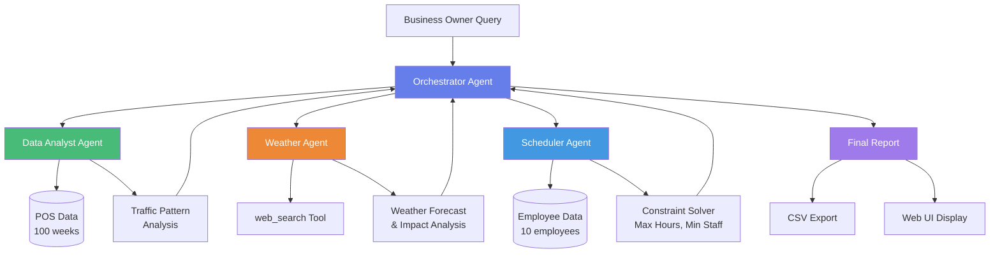
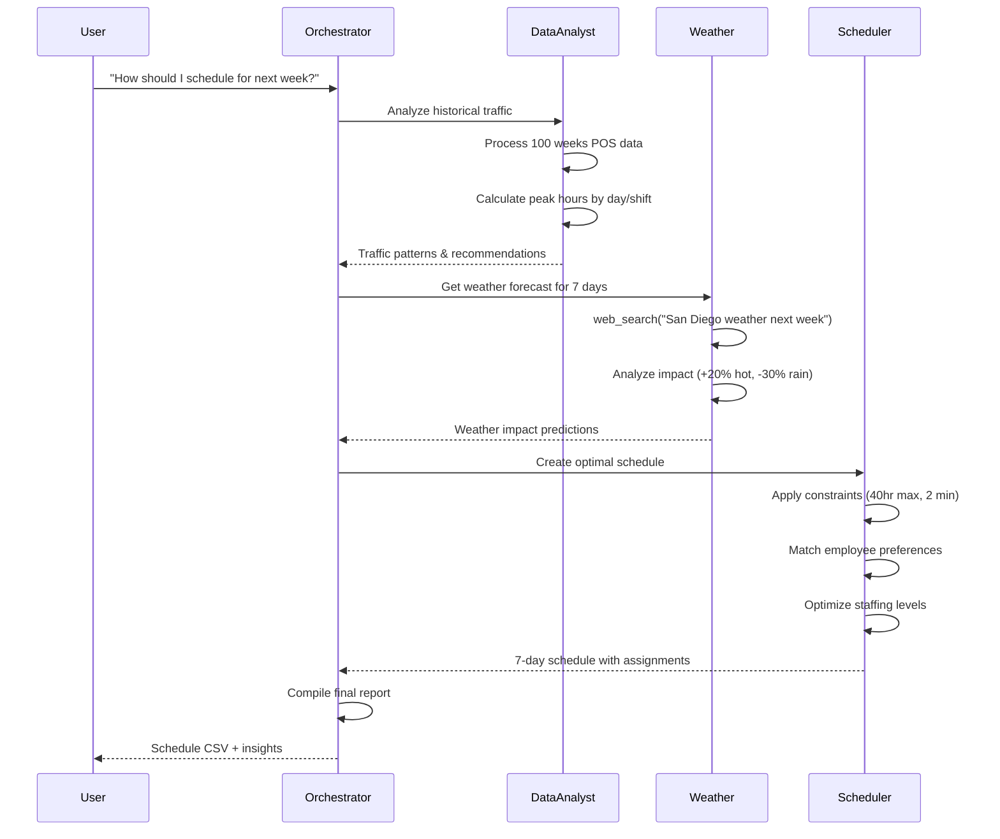
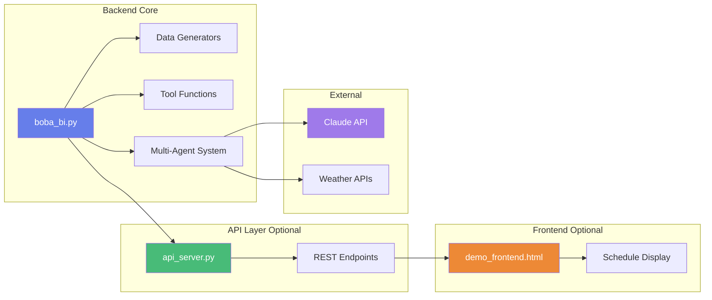
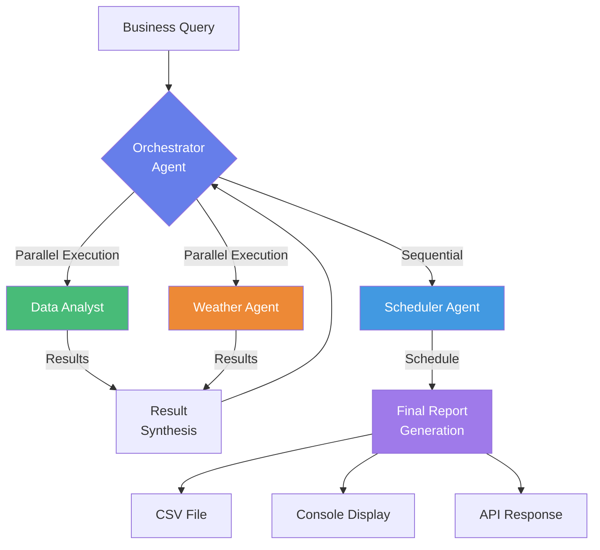
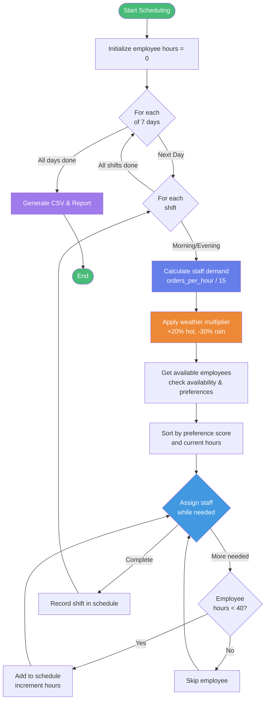
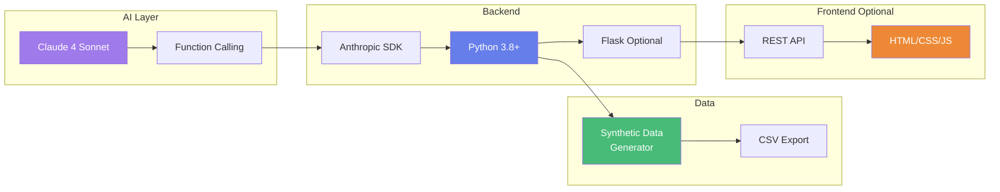

# Boba BI System Architecture

## High-Level Multi-Agent Architecture

## Data Flow Diagram

## Component Architecture

## Agent Communication Pattern

## Scheduling Algorithm Flow

## Technology Stack

---

## Usage in Presentations

### For Slide Decks
1. Copy the Mermaid code into [Mermaid Live Editor](https://mermaid.live/)
2. Export as PNG/SVG
3. Insert into PowerPoint/Google Slides

### For Documentation
- These diagrams render automatically in:
  - GitHub README.md
  - GitLab
  - VS Code (with Mermaid extension)
  - Notion
  - Obsidian

### For Hackathon Judges
Print these diagrams to show:
- System complexity
- Multi-agent coordination
- Scalable architecture
- Professional design thinking
